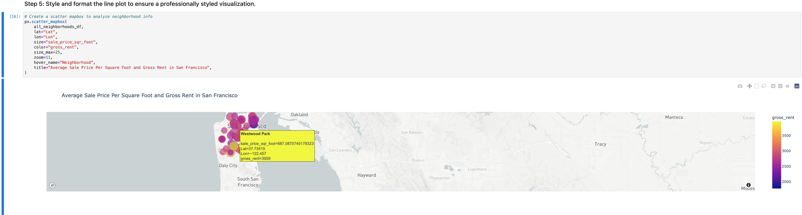
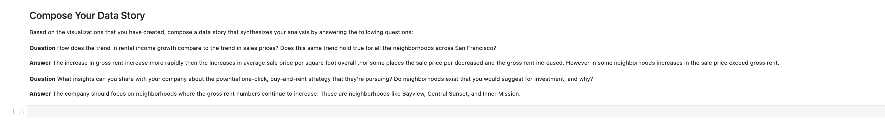

`DATA VISUALIZATION` *offer an instant, one-click service for people to buy `properties` and then rent them. The company wants to have a trial of this offering in the San Francisco real-estate market. If the service proves popular, they can then expand to other markets. Your job is to use your data visualization skills, including aggregation, **interactive visualizations**, and `geospatial` analysis, to find properties in the San Francisco market that are viable investment opportunities*.

[CLICK HERE](https://www.tableau.com/learn/articles/data-visualization) to learn more about `DATA VISUALIZATION` 🧠

## `Housing-Rental-Analysis`

# Step 1

Compare the Average Sale Prices by Neighborhood

[CLICK HERE](https://www.instructables.com/Real-Estate-Data-Visualization/) to learn how the REAL-ESTATE industry use `DATA VISUALIZATION`

# STEP 2 

Build an Interactive Neighborhood Map
    
[CLICK HERE](https://towardsdatascience.com/interactive-geospatial-data-visualization-with-geoviews-in-python-7d5335c8efd1) to learn more about interactive `Geospatial` plot

# STEP 3 

Compose Your Data Story

[CLICK HERE](https://blog.gramener.com/easy-steps-to-data-storytelling/) to learn more on  how to compose a data story

## REQUIRMENTS

[HVPLOT](https://pypi.org/project/hvplot/)

[GEOVIEWS](https://pypi.org/project/geoviews/)

[JUPYTER LAB](https://jupyter.org/install)

## INSTALLATION

[CLONE REPO](https://github.com/brprod8/Housing-Rental-Analysis.git)

[ZIP FILE](https://github.com/brprod8/Housing-Rental-Analysis/archive/refs/heads/main.zip)

## LICENSE

**Open to Experiemnt**

BY:Robert Smith

Credit:UC BERKELEY

Email : Roberts.track@yahoo.com

